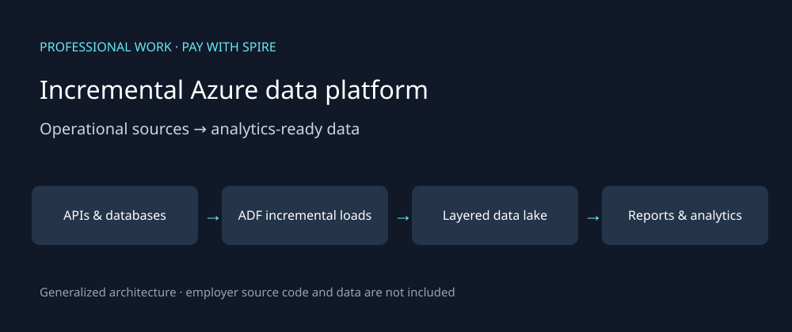

# Incremental Azure data platform

**Completed professional work · Pay with Spire · BI Analyst · Sep 2024–Jun 2026**

This case study describes my work and contribution. The diagram is generalized; public examples are synthetic and newly authored. Employer code, customer data and internal operational artifacts are not included.

## Business problem

Different operational datasets needed different refresh schedules, while reporting and analytics needed a consistent downstream foundation. I designed a layered Azure data lake and ADF workflows to connect those needs.

## My contribution

My work covered data-lake design, scheduled ingestion and archival workflows. I coordinated pipeline failure alerts with the technology team. A concrete delivery was three Zendesk pipelines for ticket fields, incremental ticket changes and full ticket metrics, with reporting moved from direct API retrieval to SQL.

## Workflow

1. Ingest operational data from APIs and databases on schedules chosen for its freshness requirements.
2. Use mainly incremental loading rather than repeatedly moving every record.
3. Organize data through bronze, silver and gold layers for downstream reporting and analytics.
4. Maintain archival workflows and coordinate failure visibility.
5. Serve reporting, marketing automation and analytics consumers.

## Engineering decisions

- Zendesk records change after creation: daily changes are not the same as new tickets.
- The recovered SQL design includes staging, persisted watermarks, latest-record selection and MERGE upserts. Delivery ownership does not mean I authored every team procedure.
- Daily and weekly schedules reflect different freshness needs; some marketing feeds ran at ten-minute intervals.
- Archival and alerting are part of operating a pipeline, not separate dashboard features. Specific retention periods and retry policies are not claimed here.

## Related orchestration and monitoring experience

I also worked with Airflow and led the Vietnam team in building Grafana dashboards for business operations. Those are related parts of my experience; the ADF pipeline volumes above are not attributed to Airflow, and business dashboards are distinct from infrastructure monitoring.

## Outcome and measurement

Approximately **2M record movements per day** across the wider set of pipelines. This is aggregate movement, not unique customers. Standard Zendesk incremental runs processed approximately **500–1,200 changed tickets per day**; the initial historical load was a separate operation.

## Public evidence and discussion

The following is an illustrative incremental-load walkthrough, not production SQL:

| Input | Expected handling |
|---|---|
| Ticket A, updated at 09:00 | Load its current state |
| Ticket A, updated at 11:00 | Update the existing ticket state |
| Same 11:00 record replayed | Avoid creating a second logical ticket |
| Ticket B created yesterday, updated today | Include it as a changed record |

I can discuss source freshness, mutable records, staging/upsert design, archive workflows and the team boundaries around monitoring.

[Back to professional work](../README.md)
