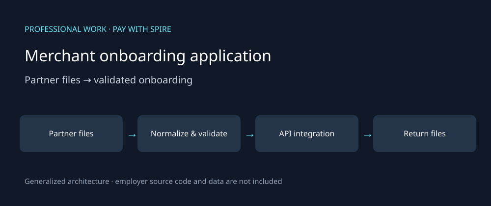

# Merchant onboarding application

**Completed professional work · Pay with Spire · BI Analyst · Sep 2024–Jun 2026**

This case study describes my work and contribution. The diagram is generalized; public examples are synthetic and newly authored. Employer code, customer data and internal operational artifacts are not included.



## Business problem

Partner-specific files and manual merchant entry made onboarding repetitive and prone to corrections. I built an application that brought ingestion, validation and partner processing into a repeatable workflow for operations.

## My contribution

I implemented and refactored the application into ingestion, validation, database, API-client and reporting components. The work included partner-file normalization, automated return files and request/response archival. Historical contribution records include modularization, verification and test-suite additions.

## Workflow

1. Read partner CSV/Excel files and normalize them into the expected structure.
2. Validate required fields, duplicate records and identifier formatting, including leading zeros.
3. Check add/change/delete requests against database context before processing.
4. Send valid requests through the API integration and produce return files for operations.
5. Keep processing artifacts available for follow-up and investigation.

## Engineering decisions

- Validation sits before processing so malformed records can be corrected early.
- Separate modules keep partner-specific parsing from spreading into the API and reporting layers.
- Historical regression and partner golden-file checks covered ingestion, reporting and integration behavior. This is not a claim of current CI coverage.
- Earlier implementation records describe Streamlit with a REST client; I also worked with FastAPI on the application. This generalized diagram does not assert a single combined deployment architecture.

## Outcome and measurement

Estimated manual-entry time avoided: **8.5 hours per week**, based on approximately 170 records × three minutes. This is an operational estimate, not a timed benchmark of this public artifact. Partner corrections also became less frequent; no percentage is asserted.

## Public evidence and discussion

For an interview, I can walk through file normalization, the validation boundary, modularization and handling partner exceptions. The public example below is newly written synthetic documentation, not an exported customer file.

```csv
merchant_id,action,partner
000123,ADD,ExamplePartner
000123,ADD,ExamplePartner
,CHANGE,ExamplePartner
```

Expected review: flag the duplicate identifier and missing identifier before processing. Preserve `000123` as text rather than converting it to `123`. Business-specific existence checks need database context.

[Back to professional work](../README.md)
