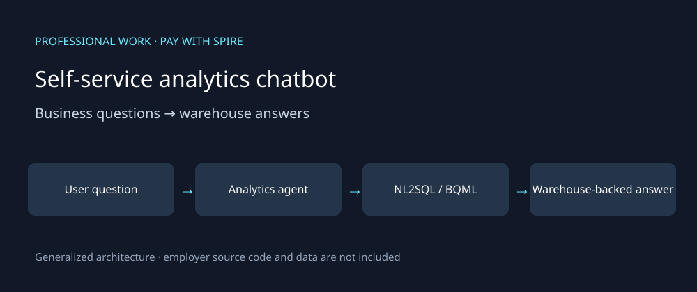

# Self-service analytics chatbot

**Completed professional work · Pay with Spire · BI Analyst · Sep 2024–Jun 2026**

This case study describes my work and contribution. The diagram is generalized; public examples are synthetic and newly authored. Employer code, customer data and internal operational artifacts are not included.

## Business problem

Recurring requests for data and insights placed work on the data team. I built a self-service analytics chatbot so business users could ask questions and receive answers through the application.

## My contribution

I built a production analytics layer over the warehouse using Google ADK and Vertex AI, with NL2SQL and BQML sub-agents, context handling and retrieval over supporting business definitions and documents.

## Workflow

1. Receive a business question through the chatbot.
2. Use the analytics orchestration layer and relevant business definitions to interpret the request.
3. Route the work to NL2SQL or BQML capabilities as appropriate.
4. Use warehouse data to produce an answer for the user.

## Engineering decisions

- Business definitions matter as much as the SQL: a technically valid query can answer the wrong business question.
- Separate ordinary warehouse querying from model-oriented analysis.
- Context handling supports follow-up questions and longer interactions.
- This is the production analytics chatbot, not the separate SBR agent-fleet prototype. No specific unrecorded access-control, query-safety or deployment topology is asserted.

## Outcome and measurement

Approximately **30% of data-team workload offloaded** to self-service querying, based on my reported operational experience. This is not an independently instrumented benchmark included with this case study.

## Public evidence and discussion

Illustrative business questions:
- How did transaction volume change this week?
- Which partners contributed most to the change?
- How does the result differ by channel?

These demonstrate the type of interaction, not published production query logs or verified screenshots. For an interview, I can explain the orchestration, warehouse integration, business definitions and adoption story. A public live connection to the employer warehouse is not provided.

[Back to professional work](../README.md)
