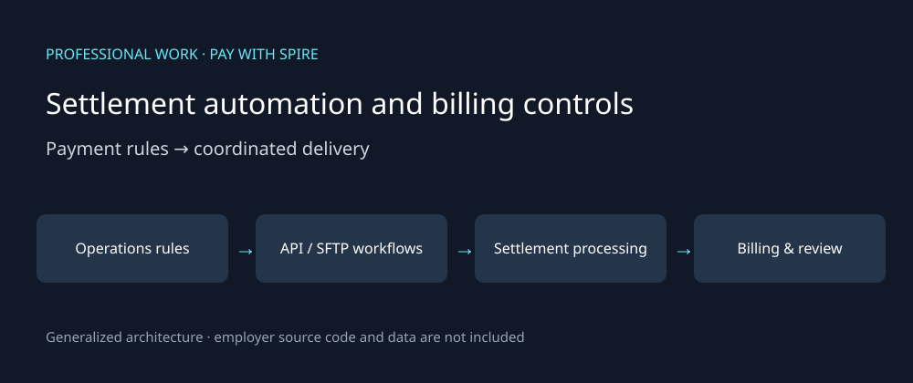

# Settlement automation and billing controls

**Completed professional work · Pay with Spire · BI Analyst · Sep 2024–Jun 2026**

This case study describes my work and contribution. The diagram is generalized; public examples are synthetic and newly authored. Employer code, customer data and internal operational artifacts are not included.

## Business problem

Credit/debit settlement work crossed internal operations, offshore engineering and an external EFT processor. Recurring billing also needed partner-specific calculations and explanations when reports disagreed.

## My contribution

I led domain architecture and cross-team delivery: translating payment rules into integration requirements, coordinating vendor API/SFTP workflows and aligning three teams. The production system was a team delivery; I do not claim sole authorship of its agent implementation. My billing work included Python/SQL reporting automation and financial validation.

## Workflow

1. Translate operational settlement rules into processing and integration requirements.
2. Agree batch formats, environments, API/SFTP behavior and return notifications with the vendor and engineering teams.
3. Coordinate processing cutoffs and handoffs across operations and engineering.
4. Produce billing detail and summaries with partner-specific eligibility and fee logic.
5. Investigate discrepancies using transaction definitions, reporting dates and settlement context.

## Engineering decisions

- Processing cutoffs and return-file behavior are part of the integration contract.
- Validate counts, amounts and fees before distributing financial reports.
- Explain differences between billing definitions and dashboard measures before treating every mismatch as missing money.
- Keep domain architecture, delivery leadership and hands-on billing automation distinct from the team's orchestration implementation.

## Outcome and measurement

The Spire reconciliation system was delivered into production. Automated billing and integration workflows replaced recurring manual processing steps. This case study emphasizes operational delivery; it does not assert a new financial saving or claim that discrepancy values were recovered funds.

## Public evidence and discussion

[My public reconciliation repository](https://github.com/ezhilan03/recon-engine) demonstrates related deterministic matching, agent investigation and evaluation using a portfolio dataset. It is **not presented as the Spire production code or deployment**.

A synthetic billing-control example: ten eligible transactions at a fictional £0.20 fee should yield a £2.00 fee total. Row counts and amount totals should also reconcile between detail and summary. These are example values, not a company fee schedule.

Interview topics include vendor coordination, resolving ambiguous rules, financial validation and communicating discrepancies to finance and operations.

[Back to professional work](../README.md)
