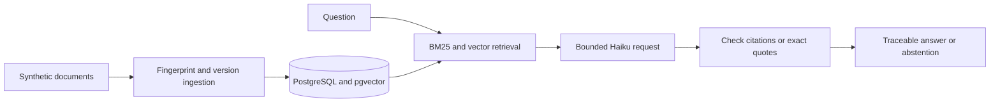

# Fintech RAG: source changes without losing trust

**v0.2.0 · Personal project · synthetic payment policies · released on-demand AWS demo**

[Repository](https://github.com/ezhilan03/fintech-rag) · [Release](https://github.com/ezhilan03/fintech-rag/releases/tag/v0.2.0) · [Successful cloud run](https://github.com/ezhilan03/fintech-rag/actions/runs/34804436930)

## Problem

Payment-policy documents change, vendors can disagree, and plausible answers can introduce unsupported conclusions. An ingestion rerun must not duplicate data, while an answer must retain a traceable connection to the source version used.

## Implementation

Content and pipeline fingerprints identify source versions. Transactions and per-source writer locks activate updates atomically and preserve historical versions. BM25, pgvector embeddings and explicit return-code lookup retrieve evidence without discarding conflicting vendor sources. The API validates citations, abstains when evidence is absent and renders verbatim excerpts for explicit comparisons.

## Evidence

84 automated tests passed. Seven real BGE/pgvector retrieval cases and eight controlled-context live grounding cases passed as separate small regression suites. The AWS run replayed six sources unchanged, returned a two-source cited answer, restored the database backup with matching chunk checksums, detected database failure with health 503 and recovered to health 200.

The Docker runtime bundles pinned CPU embeddings and runs as a non-root user. Terraform provisions the private host, registry, storage and IAM roles. GitHub Actions uses short-lived OIDC credentials; secrets remain in encrypted SSM storage. CloudWatch logs and an outcome metric were verified. Workflow cleanup and a one-hour host timer bound demo uptime.

## Tradeoff and interview lesson

An earlier model response introduced unsupported arithmetic despite valid-looking citations. The comparison path now selects exact source quotes and checks them in code. This verifies textual provenance; it does not prove a complete or semantically correct answer. Fixed synthetic suites do not establish general compliance accuracy.

The single-host demo is stopped between runs. It has no public always-on endpoint, high-availability guarantee or production workload benchmark. Broader corpus evaluation and operational scaling are separate future work.
