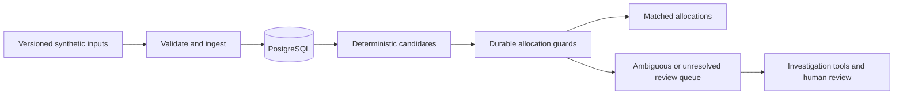

# Recon Engine: correct allocations across reruns

**Personal project · synthetic ledger and settlement data · released AWS batch demo**

[Verified cloud implementation](https://github.com/ezhilan03/recon-engine/tree/2d5f2eecd8d4096a6753d22217a6c0c4e4a6cb48) · [Published image](https://github.com/ezhilan03/recon-engine/actions/runs/34785547354) · [Successful cloud run](https://github.com/ezhilan03/recon-engine/actions/runs/34785949568)

The AWS batch milestone is evidenced by the linked successful run; no versioned GitHub release is published. The repository README retains earlier local-milestone notes.

## Problem

Ledger transactions and settlement lines may lack a shared identifier. A plausible match can still be wrong if another transaction already consumed the settlement line, or if a rerun creates duplicate allocations. Ambiguity must remain visible for review.

## Implementation

A deterministic matcher handles eligible exact and split candidates. Durable PostgreSQL allocation guards prevent conflicting claims across runs. Input manifests pin source checksums and S3 versions; ingestion and persisted results can replay safely. LangGraph/MCP tools support investigation and human review while correctness rules remain enforced by code and database transactions.

## Evidence

The AWS batch processed 500 transactions and 531 settlement lines: 342 exact matches, 41 split matches, 13 ambiguous and 104 unresolved transactions. Thus 383 were matched and 117 remained for review. These are synthetic batch outcomes, not measured matching precision or commercial savings.

The actual cloud database backup was downloaded and restored into a disposable database. Replay preserved persisted counts and inserted no duplicate source rows; a competing allocation was rejected and rolled back. CI/container publication, Terraform-managed infrastructure, private S3 evidence and on-demand execution were verified. Local Prometheus alert failure/recovery was exercised; continuous cloud Prometheus alerting is not claimed.

## Tradeoff and interview lesson

A first-valid-match strategy is insufficient when allocations must remain globally exclusive. Correctness requires durable constraints and transaction boundaries in addition to matching logic. Model confidence is not used as a substitute for those rules or for required human review.

The demo is deliberately stopped between runs, with no always-on public endpoint. It demonstrates reproducible delivery and recovery at a declared synthetic workload, not production throughput or high availability.
